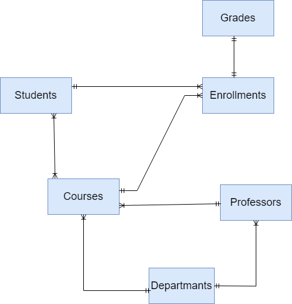

# Design Document

By Sajad Shirmahd

Video overview: <URL HERE>

## Scope

In this section you should answer the following questions:

This database system is designed for managing students, courses, professors, grades, and other information related to a university. It can be utilized by various departments of the university, such as registration, education, and etc.
* Students, including basic identifying information
* proffesors including basic identifying information
* departmant incuding the name and id of the departmant
* courcese incuding academic subjects offered by the university. such as name , desciption ,deparmant_id
* enrrolment Student registrations in courses.
* Grades	Academic performance records.

* The following are typically excluded unless specified otherwise:

Non-academic staff (e.g., janitors, security).

Dormitories/Housing (unless tracking student housing).

Cafeteria/Menus (irrelevant to academic management).

Social clubs/Events (unless tied to academic credits).

## Functional Requirements

* For Students:
View/Course Enrollment:
Check available courses.
Enroll in/drop courses (with constraints like prerequisites or capacity).
Track Academic Progress:
View grades, GPA, and transcripts.
See assigned professors/advisors.
Access Personal Data:
Update contact information (email, phone).
View enrollment history.

* For Professors:
Manage Courses:
Create/update course content (syllabus, assignments).
View enrolled students.
Record Grades:
Submit grades for students.
Track class performance (average grades, attendance if included).
Access Department Data:
View department schedules, assigned classrooms.

* The database is not designed for:
1. Non-Academic Functions:
Financial Transactions:
Tuition payments, payroll for staff (requires a separate financial system).
Campus Facilities Management:
Dorm assignments, cafeteria menus, gym memberships.
Human Resources:
Hiring/firing staff, tracking non-teaching employee records.
2. Social/Extracurricular Activities:
Club memberships, event registrations (e.g., sports, cultural festivals).
Student health records (requires HIPAA-compliant systems).

## Representation
Entities are captured in SQLite tables with the following schema.

### Entities
`Students`: Individuals enrolled in courses.
* `id`, which specifies the unique ID for the student as an `INTEGER`. This column thus has the `PRIMARY KEY` constraint applied.
* `first_name`, which specifies the student's first name as `TEXT`, given `TEXT` is appropriate for name fields.
* `last_name`, which specifies the student's last name. `TEXT` is used for the same reason as `first_name`.
* `date_of_birth` ,`DATE NOT NULL`, which is the date that a student is born.
*  `email` ,`TEXT NOT NULL UNIQUE`, is the email of the student
*  `major` , `TEXT NOT NULL`,major of student
*  `enrollment_date`, `DATETIME DEFAULT CURRENT_TIMESTAMP` is the date that join the course
* FOREIGN KEY ("`department_id`") REFERENCES departments ("`id`") connect students to the dparmants

`Professors`: Faculty teaching courses.

`id` (INTEGER, PRIMARY KEY, AUTOINCREMENT)
A unique number assigned to each professor.
Why INTEGER? Numbers are efficient for database operations like sorting and joining tables.
Why AUTOINCREMENT? Automatically generates a new ID when a professor is added, preventing duplicates.
`first_name` (TEXT, NOT NULL)
Stores the professor’s first name (e.g., "Maria").
Why TEXT? Names can vary in length and may include special characters (e.g., hyphens or accents).
Why NOT NULL? Ensures every professor has a first name—no empty entries allowed.
`last_name` (TEXT, NOT NULL)
Stores the professor’s last name (e.g., "Garcia").
Same rationale as first_name.
`email` (TEXT, NOT NULL, UNIQUE)
Stores the professor’s email address (e.g., "mgarcia@university.edu").
Why TEXT? Emails contain letters, numbers, and symbols like @ and ..
Why UNIQUE? Prevents two professors from sharing the same email (avoids account conflicts).
Why NOT NULL? Ensures contact information is always provided.
`department_id` (INTEGER, NOT NULL, FOREIGN KEY)
Links the professor to a department (e.g., "Computer Science" = ID 1).
Why INTEGER? Numbers are efficient for linking tables (e.g., joining professors with departments).
Why FOREIGN KEY? Ensures the department_id exists in the departments table (no invalid departments).
Why NOT NULL? Every professor must belong to a department.
`hire_date` (DATETIME, DEFAULT CURRENT_TIMESTAMP)
Records when the professor was hired (e.g., "2023-09-20 14:30:00").
Why DATETIME? Tracks the exact date and time of hiring (useful for seniority or payroll).
Why DEFAULT CURRENT_TIMESTAMP? Automatically fills in the current date/time if not specified, reducing manual input.

* `Courses`: Academic subjects offered.

`id` (INTEGER, PRIMARY KEY, AUTOINCREMENT)
A unique number for each course
Auto-increments so we don't have to assign numbers manually
`name` (TEXT, NOT NULL)
The course title (like "Database Systems")
Must have a name (can't be empty)
`description` (TEXT)
Details about the course content
Optional field (can be empty)
`student_id` (INTEGER, NOT NULL)
Links to which student takes the course
Must point to a real student in the students table
`credits` (INTEGER, NOT NULL, CHECK > 0)
How many credits the course is worth
Must be at least 1 credit (no zero/negative credits)
`professor_id` (INTEGER, NOT NULL)
Links to which professor teaches the course
Must point to a real professor
`department_id` (INTEGER, NOT NULL)
Links to which department offers the course
Must point to a real department

`Departments`: Academic divisions (e.g., Computer Science).

`id` (INTEGER, PRIMARY KEY, AUTOINCREMENT)
Unique number for each department (like 1 for "Computer Science")
Automatically increases so we never duplicate IDs
`name` (TEXT, NOT NULL, UNIQUE)
Department name (like "Mathematics" or "Biology")
Must have a name (can't be empty)
No duplicate names allowed (only one "Physics" department)

`Enrollments`: Links students to courses (resolves many-to-many relationships).

`id` (INTEGER, PRIMARY KEY, AUTOINCREMENT)
Unique number for each enrollment record
Automatically generates new numbers so we don't have duplicates
`student_id` (INTEGER, NOT NULL)
Links to which student is enrolling
Must point to a real student in the students table
If student gets deleted, their enrollments disappear too (ON DELETE CASCADE)
`course_id` (INTEGER, NOT NULL)
Links to which course they're enrolling in
Must point to a real course in the courses table
If course gets deleted, its enrollments disappear too (ON DELETE CASCADE)
`enrollment_date` (DATETIME, DEFAULT CURRENT_TIMESTAMP)
Records when the enrollment happened
Automatically uses current date/time if not specified
UNIQUE (student_id, course_id)
Prevents duplicate enrollments (same student can't enroll in same course twice)

`Grades`: Records student performance in courses.

`id` (INTEGER, PRIMARY KEY, AUTOINCREMENT)
Unique number for each grade record
Automatically generates new numbers to prevent duplicates

`student_id` (INTEGER, NOT NULL)
Links to which student received the grade
Must point to a real student
If student is deleted, their grades are automatically removed (ON DELETE CASCADE)
`course_id` (INTEGER, NOT NULL)
Links to which course the grade is for
Must point to a real course
If course is deleted, its grades are automatically removed (ON DELETE CASCADE)
`grade` (REAL, NOT NULL, CHECK 0-20)
Stores the actual grade score
Allows decimal values (like 18.5)
Must be between 0 and 20 (ensures valid grade range)
`semester` (TEXT, NOT NULL)
Identifies when the grade was earned (like "Fall 2023")
Uses text to accommodate various semester naming formats
UNIQUE (student_id, course_id, semester)
Prevents duplicate grades for same student/course/semester
Ensures each student can only have one grade per course per semester

### Relationships

As detailed by the diagram above:

Departments → Professors
One-to-Many
One department employs many professors
Implemented via department_id foreign key in professors table

Departments → Courses
One-to-Many
One department offers many courses
Implemented via department_id foreign key in courses table

Professors → Courses
One-to-Many
One professor teaches many courses
Implemented via professor_id foreign key in courses table

Students → Enrollments
One-to-Many
One student can enroll in many courses
Implemented via student_id foreign key in enrollments table

Courses → Enrollments
One-to-Many
One course can have many enrolled students
Implemented via course_id foreign key in enrollments table

Enrollments → Grades
One-to-One
One enrollment results in one grade per semester
Implemented via composite foreign key (student_id, course_id) in grades table

## Optimizations

Per the typical queries in `queries.sql`, it is common for users of the database to access all submissions
submitted by any particular student. For that reason, indexes are created on the `email` columns to speed the
 identification of `students` by this columns.

Similarly, it is also common practice for some of  users of the database to concerned with viewing all `grades` students get on courses.  an index is created on the `student_id` and `course_id` column in the `grades` table to speed the identification of  grades by `student_id` ,`course_id`.
## Limitations

the current schema dosent allow students to see other student grades.
